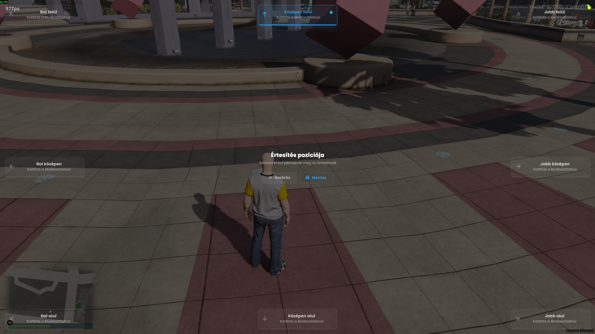

# Sharky Notify [Standalone]

Egy szimpla notify rendszer FiveM szerverek számára.
`shared.lua`-ban tudsz új típusokat létrehozni.
`/notifyposition` paranccsal tudod megnyitni a pozíció módosítására használandó panelt.

